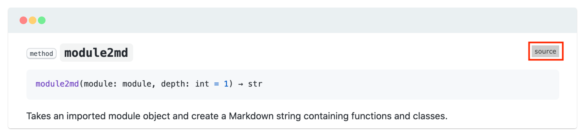
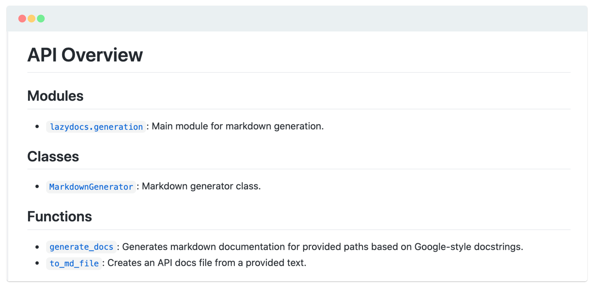

<!-- markdownlint-disable MD033 MD041 -->
<h1 align="center">
    lazydocs
</h1>

<p align="center">
    <strong>Generate markdown API documentation for Google-style Python docstring.</strong>
</p>

<p align="center">
    <a href="https://github.com/ml-tooling/lazydocs/commits/" title="Last Commit"></a>
    <a href="https://github.com/ml-tooling/lazydocs/issues" title="Open Issues"></a>
    <a href="https://github.com/ml-tooling/lazydocs/blob/main/LICENSE" title="Project License"></a>
    <a href="https://api.reuse.software/info/github.com/ml-tooling/lazydocs" title="REUSE status"></a>
    <a href="https://github.com/ml-tooling/lazydocs/actions?query=workflow%3Abuild-pipeline" title="Build status"></a>
</p>

<p align="center">
  <a href="#getting-started">Getting Started</a> •
  <a href="#features">Features</a> •
  <a href="#documentation">Documentation</a> •
  <a href="#support--feedback">Support</a> •
  <a href="#contribution">Contribution</a> •
  <a href="https://github.com/ml-tooling/lazydocs/releases">Changelog</a>
</p>

Lazydocs makes it easy to generate beautiful markdown documentation for your Python API (see this [example](./docs)). It provides a simple command-line interface as well as a Python API to get full-fledged API documentation within seconds based on all of the [Google-style docstrings](https://sphinxcontrib-napoleon.readthedocs.io/en/latest/example_google.html) in your code. This markdown documentation can be pushed to Github or integrated into your MkDocs site.

## Highlights

- ⏱&nbsp; Simple CLI to generate markdown docs in seconds.
- 📋&nbsp; Supports [Google-style Python Docstrings](https://sphinxcontrib-napoleon.readthedocs.io/en/latest/example_google.html).
- 📚&nbsp; Compatible with Github Markdown and MkDocs.

## Getting Started

### Installation

> _Requirements: Python 3.6+._

```bash
pip install lazydocs
```

### Usage

To generate Markdown-based API documentation for your Python project, simply execute:

```bash
lazydocs path/to/your/package
```

The path can be either a python package (folder) or a specific script. You can also specify one or multiple module, classe or function imports:

```bash
lazydocs my_package.AwesomeClass
```

With the default configuration, the Markdown documentation will be generated inside the `./docs` folder in your working directory. You can find additional configuration options in the [documentation section](#cli-interface).

## Support & Feedback

This project is maintained by [Benjamin Räthlein](https://twitter.com/raethlein), [Lukas Masuch](https://twitter.com/LukasMasuch), and [Jan Kalkan](https://www.linkedin.com/in/jan-kalkan-b5390284/). Please understand that we won't be able to provide individual support via email. We also believe that help is much more valuable if it's shared publicly so that more people can benefit from it.

| Type                     | Channel                                              |
| ------------------------ | ------------------------------------------------------ |
| 🚨&nbsp; **Bug Reports**       | <a href="https://github.com/ml-tooling/lazydocs/issues?utf8=%E2%9C%93&q=is%3Aopen+is%3Aissue+label%3Abug+sort%3Areactions-%2B1-desc+" title="Open Bug Report"></a>                                 |
| 🎁&nbsp; **Feature Requests**  | <a href="https://github.com/ml-tooling/lazydocs/issues?q=is%3Aopen+is%3Aissue+label%3Afeature+sort%3Areactions-%2B1-desc" title="Open Feature Request"></a>                                 |
| 👩‍💻&nbsp; **Usage Questions**   |  _tbd_ |
| 🗯&nbsp; **General Discussion** | _tbd_ |
| ❓&nbsp; **Other Requests** | <a href="mailto:team@mltooling.org" title="Email ML Tooling Team"></a> |

## Features

<p align="center">
  <a href="#source-code-linking">Source Code Linking</a> •
  <a href="#api-overview">API Overview</a> •
  <a href="#mkdocs-integration">MKDocs Integration</a> •
  <a href="#docstyle-validation">Docstyle Validation</a> •
  <a href="#print-to-console">Print to Console</a>
</p>

### Source Code Linking



Lazydocs is capable to insert a badge on the right side of every module, class, method or function with a link the correct source-code file and line number. The default configuration will create relative paths to navigate within the Github Repo. This is useful if the documentation is hosted within the same repository as the source-code. If, the documentation is hosted outside of the Github repository, it is recommended to set the `src-base-url`:

```bash
lazydocs --src-base-url="https://github.com/example/my-project/blob/main/" my_package
```

The `src-base-url` is used as a prefix for all source-code linkings in the documentation.

### API Overview



An API overview might be very useful in case your project has a large number modules, classes and functions. You can specify an `overview-file` with the lazydocs command to activate the generation of an API overview:

```bash
lazydocs --overview-file="README.md" my_package
```

The API overview will be written as markdown to the specified file with separated lists for all modules, classes, and functions of your project:

### MKDocs Integration


### Docstyle Validation

Lazydocs can only parse valid Google-style docstring. To prevent the generation of invalid markdown documentation, you can use the `validate` flag:

```bash
layzdocs --validate my_package
```

This will run [pydocstyle](https://github.com/PyCQA/pydocstyle) on your docstring and cancel the generation if an issue is found.

### Print to Console

To get the markdown documentation as console output instead of the file generation, specify `stdout` as the `output-path`:

```bash
layzdocs --output-path=stdout my_package
```

## Documentation

### CLI Interface

<!-- generated via typer-cli: typer src/lazydocs/_cli.py utils docs -->

```bash
laydocs [OPTIONS] PATHS...
```

**Arguments**:

* `PATHS...`: Selected paths or imports for markdown generation.  [required]

**Options**:

* `--output-path TEXT`: The output path for the creation of the markdown files. Set this to `stdout` to print all markdown to stdout.  [default: ./docs/]
* `--src-base-url TEXT`: The base repo link used as prefix for all source links. Should also include the branch name.
* `--overview-file TEXT`: Filename of overview file. If not provided, no API overview file will be generated.
* `--remove-package-prefix / --no-remove-package-prefix`: If `True`, the package prefix will be removed from all functions and methods.  [default: True]
* `--ignored-modules TEXT`: A list of modules that should be ignored.  [default: ]
* `--watermark / --no-watermark`: If `True`, add a watermark with a timestamp to bottom of the markdown files.  [default: True]
* `--validate / --no-validate`: If `True`, validate the docstrings via pydocstyle. Requires pydocstyle to be installed.  [default: False]
* `--install-completion`: Install completion for the current shell.
* `--show-completion`: Show completion for the current shell, to copy it or customize the installation.
* `--help`: Show this message and exit.

### Programmatic API

Lazydocs can also be used and integrated via its [Python API](https://github.com/ml-tooling/lazydocs/tree/main/docs). For example, to generate markdown for an arbitrary Python import or object:

```python
from lazydocs import MarkdownGenerator

generator = MarkdownGenerator()

# Select a module to generate markdown documentation
# Here we use the generation module itself as an example
my_module = generation
markdown_docs = generator.import2md(my_module)
```

To programmatically generate all markdown documentation files you can use [`generate_docs`](https://github.com/ml-tooling/lazydocs/blob/main/docs/lazydocs.generator.md#function-generate_docs):

```python
from lazydocs import generate_docs

# The parameters of this function correspond to the CLI options
generate_docs(["my_module"], output_path="./docs")
```

The full Python API documentation can be found [here](https://github.com/ml-tooling/lazydocs/tree/main/docs) _(generated via lazydocs)_.

## Contributors

_TODO: Add sourcerer [hall of fame](https://github.com/sourcerer-io/hall-of-fame) here._

## Contribution

- Pull requests are encouraged and always welcome. Read our [contribution guidelines](https://github.com/ml-tooling/lazydocs/tree/main/CONTRIBUTING.md) and check out [help-wanted](https://github.com/ml-tooling/lazydocs/issues?utf8=%E2%9C%93&q=is%3Aopen+is%3Aissue+label%3A"help+wanted"+sort%3Areactions-%2B1-desc+) issues.
- Submit Github issues for any [feature request and enhancement](https://github.com/ml-tooling/lazydocs/issues/new?assignees=&labels=feature&template=02_feature-request.md&title=), [bugs](https://github.com/ml-tooling/lazydocs/issues/new?assignees=&labels=bug&template=01_bug-report.md&title=), or [documentation](https://github.com/ml-tooling/lazydocs/issues/new?assignees=&labels=documentation&template=03_documentation.md&title=) problems.
- By participating in this project, you agree to abide by its [Code of Conduct](https://github.com/ml-tooling/lazydocs/blob/main/.github/CODE_OF_CONDUCT.md).
- The [development section](#development) below contains information on how to build and test the project after you have implemented some changes.

## Development

> _**Requirements**: [Docker](https://docs.docker.com/get-docker/) and [Act](https://github.com/nektos/act#installation) are required to be installed on your machine to execute the build process._

To simplify the process of building this project from scratch, we provide build-scripts that run all necessary steps (build, check, test, and release) within a containerized environment. To build and test your changes, execute the following command in the project root folder:

```bash
act -j build
```

Refer to our [contribution guides](https://github.com/ml-tooling/lazydocs/blob/main/CONTRIBUTING.md#development-instructions) for more detailed information on our build scripts and development process.

---

Licensed **MIT**. Created and maintained with ❤️&nbsp; by developers from Berlin.
